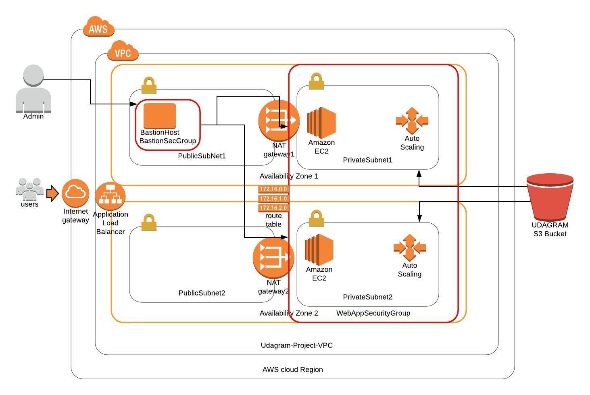

# Project 2: Udagram HA Web App



This project requirements were as followed:
* "develop a diagram that you can present as part of your portfolio and as a visual aid to understand the CloudFormation script."
* "create a matching CloudFormation script."

## Project Components:

* Diagram of Reference Architecture: `HA-WebApp-Udacity-Project2.jpeg`
* AWS CloudFormation Template: `ha-web-app.yml`
* AWS CloudFormation Parameter File: `network-params.json`
* Instructions on how to run the project: `README.MD`

### Project Prerequisites:
1. An AWS Account.
2. The `awscli` tool installed on your machine.
3. (Optional to test SSH Bastion Host Connection) An EC2 Key Pair titled `api-user`, created in the `us-west-2` region of your AWS account, and downloaded to your machine.
	> Please note to connect to web app instances from the basiton host, you will need their private ip addresses 

## Setup Instructions:
1. Clone or download the files in this repository.
2. Navigate to the project directory:
	```
	$ cd /path/to/udagram-udacity-project
	```
2. Run the following command from within the project directory:
	```
	$ aws cloudformation create-stack --stack-name udagram-project --template-body file://ha-web-app.yml --parameters file://network-params.json --capabilities "CAPABILITY_IAM" "CAPABILITY_NAMED_IAM" --region=us-west-2
	```
4. Run the following commands to view the `Exports`:
    ```
    $ aws cloudformation list-exports
    ```
5. Test the following Export: `Udagram-Project-LB-URL`